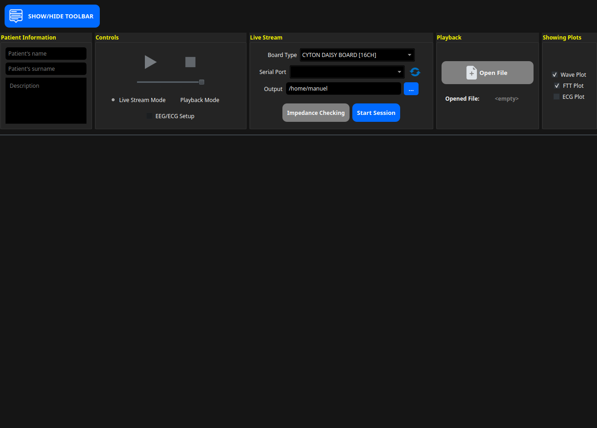
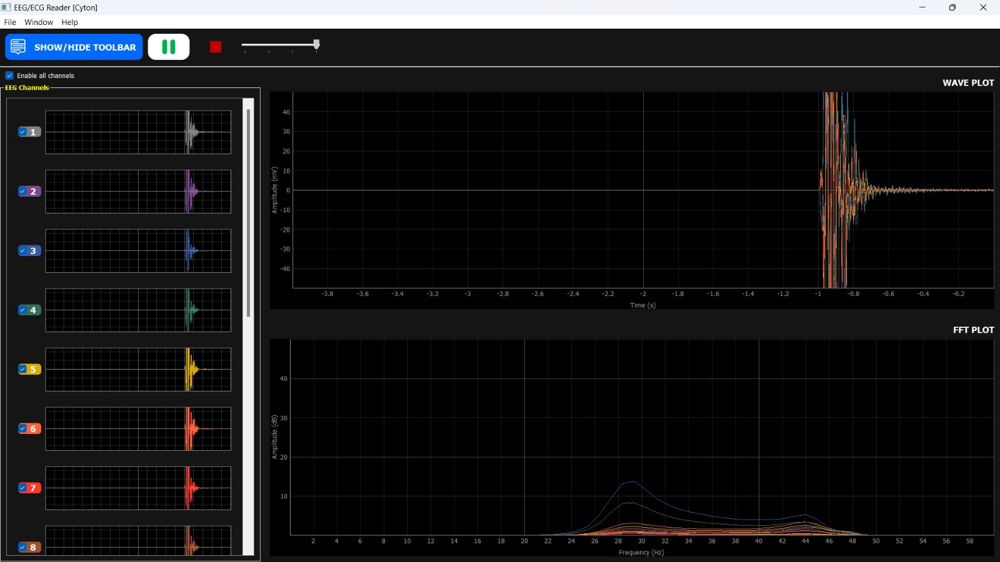
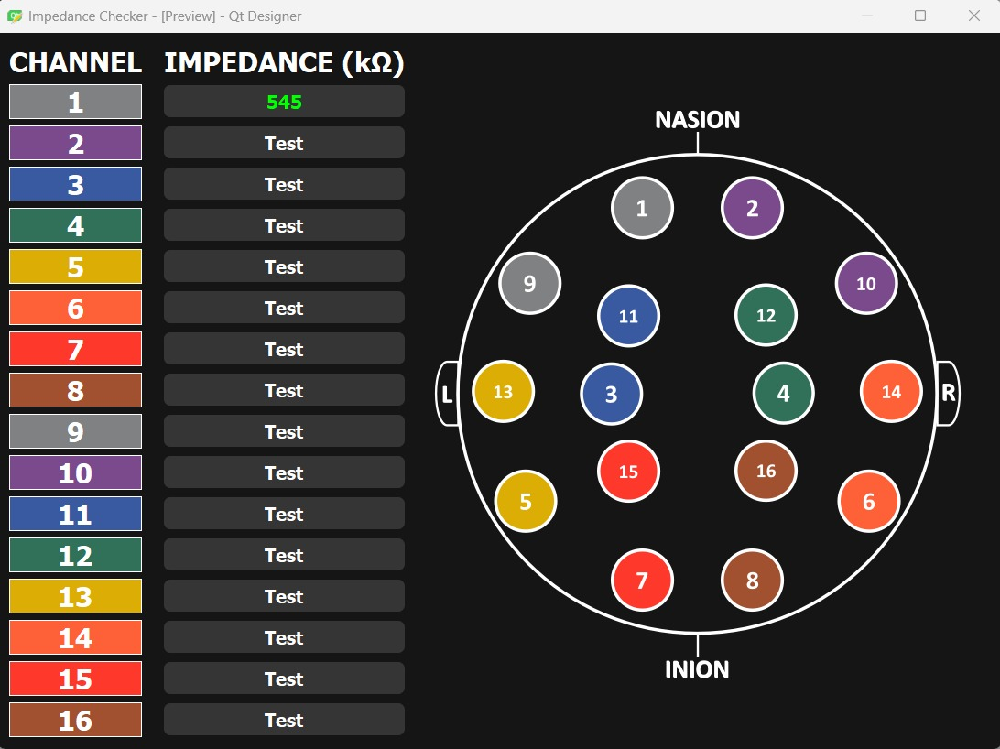

<!-- toc start: 3 [do not erase this comment] -->
**Table of contents**
- [EEG\ECG Reader: ULTRACORTEX MarkIV](#eegecg-reader-ultracortex-markiv)
- [Description](#description)
	- [Session](#session)
	- [Impedance Checker](#impedance-checker)
- [Dependencies](#dependencies)
- [How to run](#how-to-run)
- [Used technologies](#used-technologies)
- [Known issues](#known-issues)
- [Demo](#demo)
- [License](#license)
- [Authors](#authors)
	- [Contacts](#contacts)
<!-- toc end [do not erase this comment] -->

# EEG\ECG Reader: ULTRACORTEX MarkIV

This repository contains the source code of the software tool presented in the paper *"Emotion Recognition Tool for Brain-Computer Interface"*. The tool aims to provide an easy-to-use interface to analyse *EEG* and *ECG* signals collected by the **OpenBCI Ultracortex Mark IV headset** and to recognize the emotion experienced by a subject through a previously trained AI model.

# Description

The software starts with a simple toolbar which allows the user to select the modality he wants to work with and to choose what plots he wants to see.

The toolbar contains 5 sections:
- **Patient Information**: allow to insert some informations about the subject that is wearing the headset, in order to make the labeling of the signals easier.
- **Controls**: this section contains all the tools needed to manage the streaming of the signals (play/pause, stop, etc...). We can also choose if we want to stream data directly from the headset or if we want to upload a file containing previously recorded signals. Moreover, here it is possible to specify if the headset is configured to also collect ECG signals.
- **Live Stream**: this section regards the *live stream* modality of the tool, where we can stream in real-time data collected by the headset. It allow us to choose what board is mounted on the headset, the serial port where the dongle is connected and the directory where all the recordings will be stored. When we click on the *"Start session"* button, all the plots will be shown and streaming and the recording of the signals will start. The *"Impedance Checking"* button opens a new window which will help us to fix the position of the electrodes.
- **Playback**: this other section refers to the *playback* modality, where we can upload a file which contains previously recorded signals and start a simulation of the recording session.
- **Showing Plots**: the last section allow us to choose what plots we want to see when either the live stream or the playback session will start.

## Session

When we start a session in either *live stream* or *playback* modality and we are using the default configuration, the following plots will appear:

On the left side of the screen there are the time series plots for all the headset electrodes. Indeed, here we can see the signals collected by each single electrode. Moreover, we can also choose to disable some channels using the corresponding checkboxes, in order to focus only on few electrodes reducing the amount of noise produced by the others.

On the right side of the screen there is the **Wave Plot**, which is a combination of the time series plot of all the electrodes, and the **FFT Plot** that shows the signals in the frequency domain.

## Impedance Checker

When we click on the "Impedance Checking" button in the toolbar, the Impedance Checker tool will open. Here we can test all the electrodes one at a time and check if they are well positioned on the head of the subject. If so, the resulting value will be colored green, otherwise it will be red.

To help the user to individuate the electrodes on the headset, the tool assigns a different color to each one and provides a map of the electrodes position.

# Dependencies
[Emilio]
# How to run
[Emilio]
# Used technologies
[Emilio]
# Known issues

- ECG plots are still in development and they could not be used to analyze the ECG of a subject.
- The software is not yet able to load a trained model to perform emotion recognition. This feature will be added in the next updates together with the models presented in the paper.

# Demo
[Emilio]
# License

`GNU GENERAL PUBLIC LICENSE 3.0`

# Authors

* Angelo Ciaramella
* Emanuel Di Nardo
* Emilio Garzia
* Manuel Manco
* Davide De Angelis

## Contacts

* [Emilio Garzia](mailto:emilio.garzia001@studenti.uniparthenope.it)
* [Manuel Manco](mailto:manuel.manco001@studenti.uniparthenope.it)
