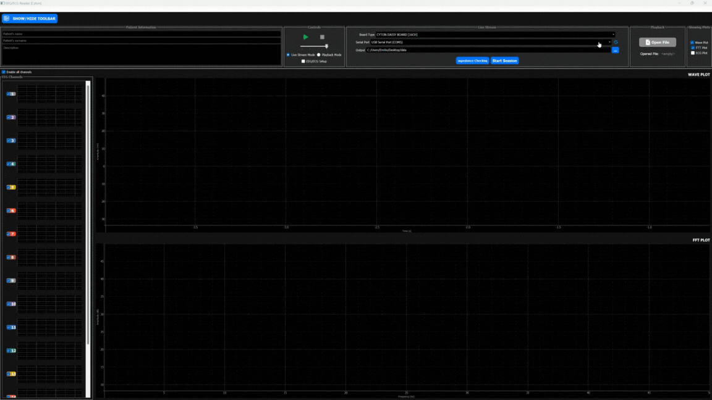
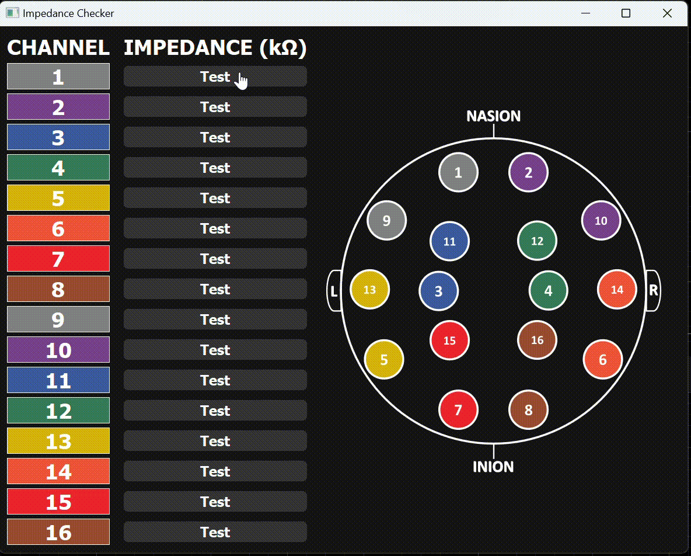

<!-- toc start: 3 [do not erase this comment] -->
**Table of contents**
- [EEG\ECG Reader: ULTRACORTEX MarkIV](#eegecg-reader-ultracortex-markiv)
- [Description](#description)
- [Dependencies](#dependencies)
- [How to run](#how-to-run)
- [Usage](#usage)
	- [How to start Stream session](#how-to-start-stream-session)
	- [How to start Playback session](#how-to-start-playback-session)
	- [How to check impedance channels](#how-to-check-impedance-channels)
- [Known issues](#known-issues)
- [Demo](#demo)
- [License](#license)
- [Authors](#authors)
	- [Contacts](#contacts)
<!-- toc end [do not erase this comment] -->

# EEG\ECG Reader: ULTRACORTEX MarkIV
[Manuel]
# Description
[Manuel]
# Dependencies

* `brainflow==5.12.1`
* `numpy==1.26.2`
* `PyQt5==5.15.10`
* `PyQt5-Qt5==5.15.2`
* `PyQt5-sip==12.13.0`
* `pyqtgraph==0.13.7`
* `pyserial==3.5`

# How to run

Enter into the directory:

`EEG_ECG-Reader-ULTRACORTEX-MarkIV\python`

Run the command:

`python main.py`

# Usage

## How to start Stream session

1. Check the radio button `Live stream mode`
1. Refresh the serial port list item
1. Choose the serial port linked with the headset
1. Click on the button `Start session`
1. Click on the `play` icon in the `Controls` tab

## How to start Playback session

1. Check the radio button `Playback Mode`
1. The `Open File` button will be enabled, click on it
1. Choose the CSV file that contain your data
1. Click on the `play` icon in the `Controls` tab

## How to check impedance channels

1. Refresh the `Serial port` list item
1. Choose the right port
1. Click on the button `Impedance Checking`

# Known issues

[Manuel]

# Demo

> Live stream DEMO

> Impedance window DEMO

# License

`GNU GENERAL PUBLIC LICENSE 3.0`

# Authors

* Angelo Ciaramella
* Emanuel Di Nardo
* Emilio Garzia
* Manuel Manco
* Davide De Angelis

## Contacts

* [Emilio Garzia](mailto:emilio.garzia001@studenti.uniparthenope.it)
* [Manuel Manco](mailto:manuel.manco001@studenti.uniparthenope.it)
